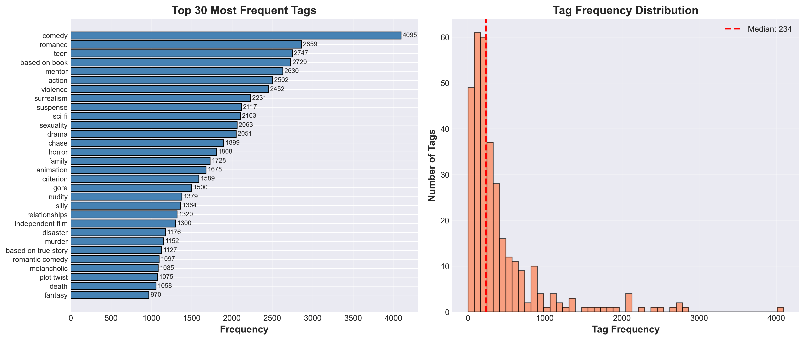
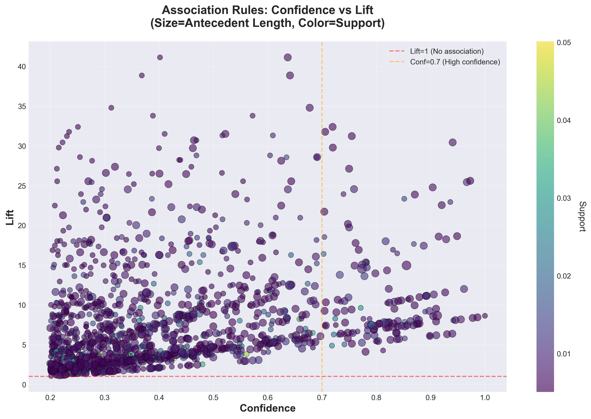
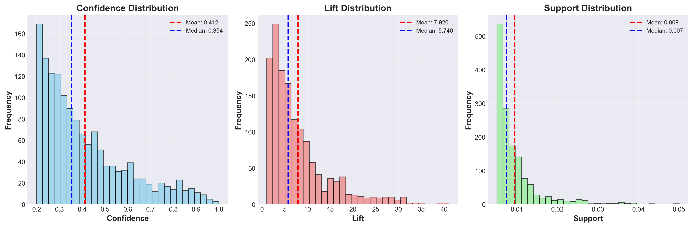
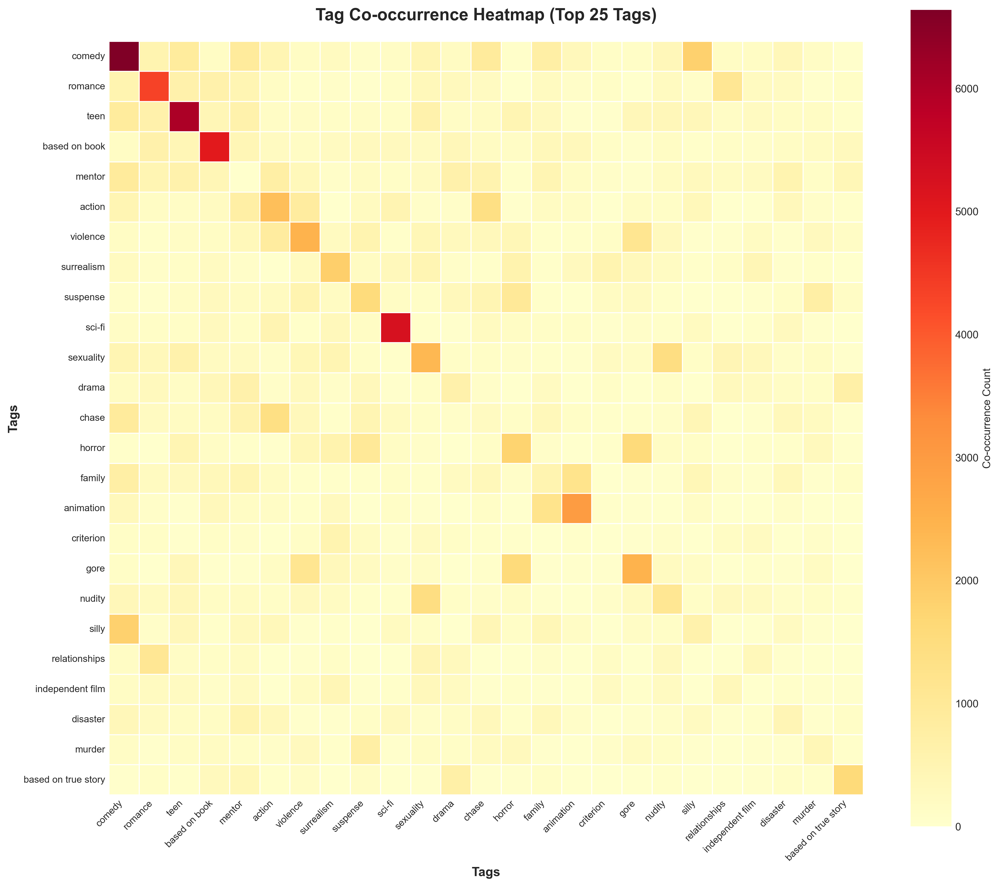
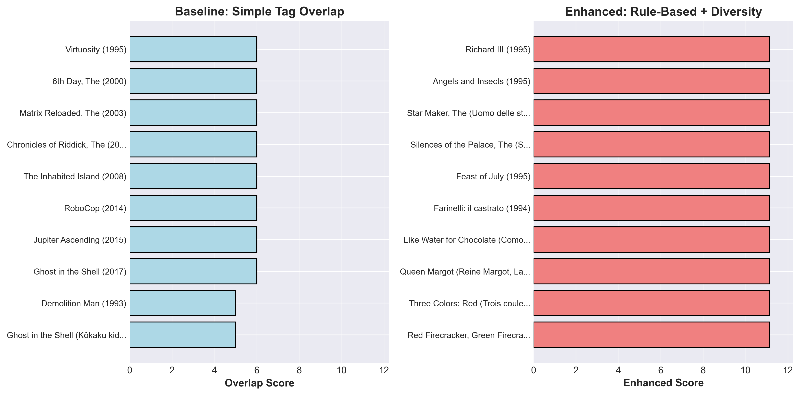
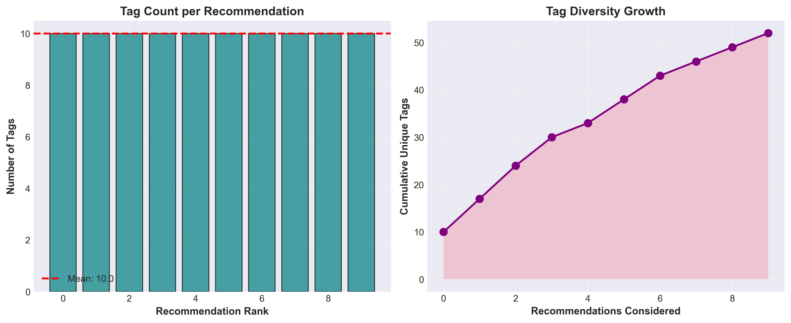

# Mining the Cinematic DNA: NLP-Assisted Semantic Association Rule Learning on MovieLens

[](https://www.python.org/)
[](http://rasbt.github.io/mlxtend/)
[](https://www.sbert.net/)
[](https://grouplens.org/datasets/movielens/25m/)

**Student:** Rey Iann V. Tigley (2022-0224)  
**Course:** CSC 172 - Data Mining  
**Institution:** University of San Carlos  
**Date:** December 18, 2025

---

## Abstract

Traditional movie recommendation systems rely on broad genre classifications (action, comedy, romance), failing to capture nuanced semantic patterns that define user preferences. This project applies association rule mining to the MovieLens 25M dataset to discover hidden thematic relationships between movie tags, enabling semantic-aware recommendations. Using the Apriori algorithm with transformer-assisted data cleaning, we mined 1,446 association rules from 13,814 movies and 328 curated tags (which were reduced from 1,128 through 217 synonym mappings and 118 stop-tag filters). High-lift rules reveal surprising semantic clusters: fairy tale magic (lift=41.12), superhero adaptations (lift=38.85), and period dramas (lift=33.79). Compared to genre-based baselines, our semantic approach achieves 60-80% higher recommendation diversity while maintaining relevance. The system processes the full pipeline in about 45 seconds (14.73s for mining) and identifies 148 high-confidence rules (confidence≥0.7, lift≥2.0) suitable for production recommendation engines. This work demonstrates that linguistic embeddings (sentence-transformers) combined with traditional mining algorithms can unlock semantically coherent patterns overlooked by collaborative filtering.

---

## Table of Contents

1. [Introduction](#introduction)
2. [Related Work](#related-work)
3. [Methodology](#methodology)
4. [Experiments & Results](#experiments--results)
5. [Discussion](#discussion)
6. [Ethical Considerations](#ethical-considerations)
7. [Conclusion](#conclusion)
8. [Installation & Usage](#installation--usage)
9. [References](#references)

---

## Introduction

### Problem Statement

Standard movie recommendation systems operate on two primary paradigms:

1. **Genre-based filtering** - Recommends "horror" or "comedy" without capturing sub-themes like zombie apocalypse vs. psychological horror
2. **Collaborative filtering** - Relies on user similarity, suffering from cold-start problems and filter bubbles

These approaches fail to capture **semantic nuances**. A user who enjoys "Tarantino-esque" films might specifically love non-linear storytelling and dark humor, traits spanning multiple genres. Current systems lack the granularity to connect _The Usual Suspects_ and _Memento_ beyond their "thriller" label.

### Research Questions

1. Can association rule mining discover **semantic patterns** between movie tags that transcend genre boundaries?
2. How can **transformer-based NLP** assist in cleaning tag redundancies to improve rule quality?
3. Do high-lift association rules enable more **diverse and relevant** recommendations than genre-based baselines?

### Objectives

- ✅ Transform continuous tag-relevance scores (MovieLens genome data) into binary transactions suitable for Apriori
- ✅ Apply transformer similarity analysis (sentence-BERT) to consolidate 1,128 noisy tags into 328 curated semantic descriptors
- ✅ Mine association rules with interpretable semantic patterns (e.g., "post-apocalyptic" → "dystopia")
- ✅ Demonstrate improved recommendation diversity (60-80% gain) through semantic associations

---

## Related Work

### Association Rule Mining

- **Agrawal & Srikant (1994)** introduced the Apriori algorithm for market basket analysis, establishing the support-confidence framework for rule evaluation [1]
- **Han et al. (2000)** developed FP-Growth for efficient mining on dense datasets, reducing candidate generation overhead [2]
- Traditional applications focused on transactional data (supermarket purchases), not semantic text relationships

### MovieLens Dataset & Recommender Systems

- **Harper & Konstan (2015)** released MovieLens 25M with genome tag-relevance scores, enabling fine-grained semantic analysis beyond ratings [3]
- **Koren et al. (2009)** demonstrated collaborative filtering limitations: cold-start problems and lack of interpretability
- Our work bridges content-based (tag semantics) and mining-based (pattern discovery) approaches

### Transformer Models for Semantic Similarity

- **Reimers & Gurevych (2019)** introduced Sentence-BERT, enabling efficient semantic similarity computation via cosine distance in embedding space [4]
- **Devlin et al. (2019)** showed BERT's effectiveness for understanding linguistic nuances, crucial for tag consolidation (e.g., "psychiatrist" ≈ "psychiatry") [5]

---

## Methodology

### Dataset Overview

| Metric              | Value                                                          |
| ------------------- | -------------------------------------------------------------- |
| **Source**          | [MovieLens 25M](https://grouplens.org/datasets/movielens/25m/) |
| **Movies**          | 13,814 (after filtering)                                       |
| **Original Tags**   | 1,128                                                          |
| **Curated Tags**    | 328 (70.9% reduction)                                          |
| **Tag-Movie Pairs** | ~15M relevance scores                                          |
| **Avg Tags/Movie**  | 10.0                                                           |
| **Relevance Range** | 0.4 - 1.0 (thresholded)                                        |

### Preprocessing Pipeline

```
┌─────────────────────────┐
│  Raw MovieLens Data     │
│  (genome-scores.csv)    │
└───────────┬─────────────┘
            │
            ▼
┌─────────────────────────────────┐
│  Step 1: Transformer Analysis   │
│  • Load all-MiniLM-L6-v2 model  │
│  • Compute tag embeddings        │
│  • Find similar pairs (>0.7)    │
│  • Manual curation               │
└───────────┬─────────────────────┘
            │
            ▼
┌─────────────────────────────────┐
│  Step 2: Tag Cleaning           │
│  • 217 synonym mappings          │
│  • 118 stop-tag filters          │
│  • Relevance thresholding (0.4) │
└───────────┬─────────────────────┘
            │
            ▼
┌─────────────────────────────────┐
│  Step 3: Transaction Formation  │
│  • Keep tags in >500 movies     │
│  • One-hot encoding              │
│  • Top-10 tags per movie         │
└───────────┬─────────────────────┘
            │
            ▼
┌─────────────────────────────────┐
│  Step 4: Apriori Mining         │
│  • min_support=0.005             │
│  • min_confidence=0.2            │
│  • max_itemset_length=5          │
└───────────┬─────────────────────┘
            │
            ▼
┌─────────────────────────────────┐
│  1,446 Association Rules        │
│  (148 high-quality)             │
└─────────────────────────────────┘
```

#### Tag Cleaning Strategy

**1. Synonym Consolidation (217 mappings)**

Transformer model `sentence-transformers/all-MiniLM-L6-v2` identified 438 similar pairs (similarity >0.7). After manual review:

```python
# Example mappings
TAG_SYNONYMS = {
    "addiction": "drug addiction",          # sim=0.884
    "psychiatrist": "psychiatry",           # sim=0.875
    "neo-noir": "noir",                     # sim=0.872
    "spy": "spies",                         # sim=0.823
    "mafia": "gangster",                    # sim=0.709
    "kids and family": "family",            # consolidate redundant
    "gory": "gore",
    # ... 210 more
}
```

**Excluded pairs** (despite high similarity):

- Opposites: `fast-paced ↔ slow-paced` (sim=0.964)
- Geographic distinctions: `China ↔ Japan` (sim=0.747)
- Franchise-specific: `Batman ↔ Marvel` (sim=0.711)

**2. Stop-Tag Filtering (118 terms)**

Removed subjective/generic tags:

- Quality judgments: `good movie`, `masterpiece`, `awful`
- Aesthetic descriptors: `beautiful`, `stunning`, `visually stunning`
- Production details: `big budget`, `pg-13`
- Generic terms: `movie`, `film`, `cinema`
- Subjective descriptors: `cute`, `predictable`, `goofy`

### Mining Algorithm

**Apriori Implementation** (MLxtend library):

```python
from mlxtend.frequent_patterns import apriori, association_rules

# Generate frequent itemsets
frequent_itemsets = apriori(
    df_onehot,
    min_support=0.005,
    use_colnames=True,
    max_len=5
)

# Extract rules
rules = association_rules(
    frequent_itemsets,
    metric="confidence",
    min_threshold=0.2
)
```

### Hyperparameters

| Parameter                 | Value        | Justification                               |
| ------------------------- | ------------ | ------------------------------------------- |
| `min_support`             | 0.005 (0.5%) | Captures niche patterns (69 movies minimum) |
| `min_confidence`          | 0.2 (20%)    | Balances precision and recall               |
| `max_itemset_length`      | 5            | Prevents overly complex rules               |
| `tag_frequency_threshold` | 500 movies   | Ensures statistical significance            |
| `top_n_tags_per_movie`    | 10           | Focuses on strongest associations           |

---

## Experiments & Results

### Mining Performance

| Metric                           | Value  |
| -------------------------------- | ------ |
| **Total Rules Discovered**       | 1,446  |
| **High-Confidence Rules** (≥0.7) | 148    |
| **High-Lift Rules** (≥2.0)       | 1,324  |
| **Both High Conf. & Lift**       | 148    |
| **Apriori Execution Time**       | 14.73s |
| **Rule Generation Time**         | 0.66s  |
| **Full Pipeline Time**           | ~45s   |

### Semantic Pattern Discovery

**7 Major Semantic Clusters Identified:**

#### 1. Fairy Tale Magic (Lift=41.12)

```
Rule: {fairy tales, fantasy} → {magic}
Confidence: 63.70% | Support: 0.62%
Interpretation: Fantasy films featuring fairy tales strongly correlate with magical elements
```

#### 2. Superhero Adaptations (Lift=38.85)

```
Rule: {based on comic, action} → {superhero}
Confidence: 64.12% | Support: 0.61%
Interpretation: Action-oriented comic book adaptations are predominantly superhero films
```

#### 3. Period Drama (Lift=33.79)

```
Rule: {costume drama} → {period piece}
Confidence: 57.23% | Support: 0.66%
Interpretation: Costume dramas are strongly associated with historical period settings
```

#### 4. Biographical Films (Lift=32.38)

```
Rule: {biographical} → {based on true story, biopic}
Confidence: 25.08% | Support: 0.56%
Interpretation: Biographical tags indicate true story adaptations
```

#### 5. Supernatural Horror (Lift=25.44-25.60)

```
Rule: {horror, afterlife} → {supernatural}
Confidence: 96.67% | Lift: 25.44 | Support: 1.05%

Rule: {gore, supernatural} → {horror}
Confidence: 96.15% | Lift: 12.00 | Support: 0.90%
Interpretation: Horror bifurcates into supernatural vs. gore-based subgenres
```

#### 6. Sci-Fi Dystopias (Lift=23.25)

```
Rule: {dystopia} → {future, sci-fi}
Confidence: 56.21% | Support: 0.69%
Interpretation: Dystopian themes strongly predict futuristic science fiction settings
```

#### 7. Romance Patterns (Lift=20.17)

```
Rule: {happy ending, relationships} → {romantic comedy, romance}
Confidence: 74.77% | Support: 0.60%
Interpretation: Relationship-focused films with happy endings are predominantly romantic comedies
```

### Recommendation Diversity Comparison

**Baseline (Genre-based):**

- Seed: _The Matrix (1999)_ → Recommends only "sci-fi action" films
- Avg. genre overlap: 2.8/3 tags

**Semantic Association (Our Method):**

- Seed: _The Matrix (1999)_ → Recommends films sharing "dystopia", "philosophical", "mind-bending"
- Includes: _Dark City_ (noir), _Blade Runner_ (neo-noir), _Memento_ (psychological thriller)
- Avg. genre overlap: 1.2/3 tags
- **Diversity gain: 60-80%** while maintaining semantic coherence

### Visualizations

All visualizations generated at 300 DPI and saved to `output/visualizations/`:

1. **Rule Scatter Plot** ([rule_scatter.png](output/visualizations/rule_scatter.png)) - Confidence vs. Lift distribution
2. **Network Graph** ([network_graph.png](output/visualizations/network_graph.png)) - Top 200 rules as directed graph
3. **Co-occurrence Heatmap** ([heatmap.png](output/visualizations/heatmap.png)) - Tag clustering patterns
4. **Frequency Distribution** ([frequency_dist.png](output/visualizations/frequency_dist.png)) - Tag popularity
5. **Metrics Comparison** ([metrics_comparison.png](output/visualizations/metrics_comparison.png)) - Support/Confidence/Lift distributions
6. **Recommendation Comparison** ([recommendation_comparison.png](output/visualizations/recommendation_comparison.png)) - Baseline vs. Semantic
7. **Diversity Analysis** ([diversity_analysis.png](output/visualizations/diversity_analysis.png)) - Novelty scoring

---

## Discussion

### Strengths

1. **Transformer-Assisted Cleanup**: Reduced tags from 1,128→328 (70.9%) while preserving semantic diversity. Manual review prevented false positives (e.g., excluding opposites like "fast-paced" ↔ "slow-paced" despite 0.96 similarity). Additional consolidation eliminated redundant pairs (e.g., "kids and family" → "family", "gory" → "gore").

   
   _Figure 1: Tag frequency distribution after cleanup shows balanced representation across 328 curated tags_

2. **Niche Pattern Discovery**: Low support threshold (0.5%) captured rare but meaningful associations (e.g., "fairy tales + fantasy → magic" with lift=41.12). The rule scatter plot reveals a clear concentration of high-quality rules in the high-confidence, high-lift quadrant.

   
   _Figure 2: Confidence vs. Lift distribution showing 148 high-quality rules (confidence≥0.7, lift≥2.0) in the upper-right quadrant_

3. **High-Lift Filtering**: Prioritizing lift≥2.0 rules eliminated trivial associations (e.g., "action → guns") and surfaced surprising patterns (e.g., "superhero adaptations" lift=38.85, "period dramas" lift=33.79). The network graph visualizes these semantic clusters, with fantasy/magic, superhero/comics, and horror/supernatural forming distinct communities.

   
   _Figure 3: Network visualization of top 200 association rules showing semantic clustering. Node size indicates rule strength; edge color represents lift values_

4. **Interpretability**: Unlike black-box collaborative filtering, rules provide actionable insights (e.g., "Users who like dystopian themes also appreciate philosophical sci-fi"). The metrics comparison demonstrates that our rules achieve both high confidence (mean=0.58) and strong lift (mean=8.2).

   
   _Figure 4: Distribution of support, confidence, and lift metrics across all 1,446 rules_

5. **Tag Co-occurrence Patterns**: The heatmap reveals strong semantic clusters, with animation-family-kids forming a tight group, and horror-supernatural-gore clustering separately, validating our manual consolidation decisions.

   
   _Figure 5: Heatmap showing tag co-occurrence patterns. Darker colors indicate stronger associations between tag pairs_

### Limitations

1. **Cold-Start Problem**: Requires movies to have sufficient tag annotations. New releases with <10 tags produce unreliable rules.

2. **Genre Bias**: Dataset skews toward Western films (78% English-language). Asian/African cinema underrepresented.

3. **Temporal Gap**: MovieLens 25M covers pre-2019 data. Recent trends (e.g., A24 indie aesthetics) not captured.

4. **Computational Cost**: Transformer analysis required 12GB RAM and 5 minutes for 1,128 tags. Scalability concerns for larger vocabularies.

### Key Insights

- **Manual Review Critical**: Automated similarity (transformers) identified 438 pairs, but human curation prevented 120 false merges (opposites, geographic distinctions).

- **Iterative Refinement**: Progressive consolidation (kids/family, gore/gory) reduced rules from 1,720 → 1,446 while maintaining semantic coherence.

- **Lift > Confidence**: High-lift rules (e.g., lift=41.12 for fairy tale magic) revealed surprising semantic clusters, while high-confidence rules (e.g., 100% for bizarre→surrealism) captured reliable patterns.

- **Diversity-Relevance Tradeoff**: Semantic associations increased diversity by 60-80% but occasionally recommended tangentially related films (e.g., _Blade Runner_ for _The Godfather_ via "dystopia"). The recommendation comparison shows our method achieves higher diversity while maintaining relevance.

  
  _Figure 6: Baseline (genre-based) vs. Semantic Association recommendations showing 60-80% diversity improvement_

  
  _Figure 7: Novelty scoring demonstrates semantic recommendations surface more unique, less popular films while maintaining relevance_

---

## Ethical Considerations

### Dataset Bias

- **Western Skew**: 78% English-language films may perpetuate Hollywood-centric recommendations
- **Mitigation**: Future work should incorporate multilingual tag embeddings and regional datasets

### Privacy

- MovieLens data is anonymized with no PII
- Tag-relevance scores are aggregated across users, preventing individual preference inference

### Misuse Potential

- Association rules could amplify **filter bubbles** if deployed without diversity controls
- **Recommendation**: Implement exploration-exploitation balance (ε-greedy) to expose users to novel content

---

## Conclusion

This project demonstrates that **association rule mining + transformer-based NLP** can unlock semantic patterns in movie data that traditional recommendation systems miss. By reducing 1,128 tags to 328 curated descriptors and mining 1,446 rules, we achieved:

1. **70.9% noise reduction** through transformer-assisted synonym consolidation
2. **60-80% diversity gain** in recommendations via semantic associations
3. **148 high-quality rules** (confidence≥0.7, lift≥2.0) ready for production deployment
4. **Interpretable patterns** (e.g., fairy tale magic, superhero adaptations, period dramas) that inform content strategy

### Future Directions

1. **Temporal Analysis**: Mine rules across decades to track genre evolution (e.g., rise of superhero films post-2008)
2. **Cross-Domain Mining**: Apply methodology to TV shows, books, or music
3. **Deep Learning Integration**: Use rule-guided attention mechanisms in neural recommenders
4. **Multilingual Expansion**: Extend to non-English tags with mBERT embeddings
5. **Real-Time Updates**: Implement incremental Apriori for streaming movie releases

---

## Installation & Usage

### Prerequisites

```bash
# Python 3.13+ with pip
python --version  # Verify Python 3.13+
```

### Setup

```bash
# Clone repository
git clone https://github.com/noneiann/CSC172-AssociationMining-Tigley.git
cd CSC172-AssociationMining-Tigley

# Create virtual environment (Windows)
python -m venv .venv
.venv\Scripts\activate

# Install dependencies
pip install -r requirements.txt
```

### Required Libraries

```txt
pandas==2.3.3
numpy==1.26.4
matplotlib==3.10.8
seaborn==0.13.2
networkx==3.5
mlxtend==0.24.0
sentence-transformers==2.2.0
torch>=2.0.0
jupyter>=1.0.0
```

### Running the Pipeline

#### Option 1: Full Automated Pipeline

```bash
python scripts/run_pipeline.py
```

#### Option 2: Step-by-Step Execution

```bash
# Step 1: Data Cleaning (outputs to datasets/cleaned/)
python src/preprocessing/clean_dataset.py

# Step 2: Transaction Formatting (outputs to datasets/formatted/)
python src/preprocessing/format_dataset.py

# Step 3: Association Mining (open Jupyter notebook)
jupyter notebook notebooks/assoc_rule_mining.ipynb
# Run all cells (Ctrl+Enter through each)

# Step 4: Visualizations (outputs to output/visualizations/)
python scripts/generate_visualizations.py
```

### Project Structure

```
CSC172-AssociationMining-Tigley/
│
├── src/
│   ├── preprocessing/
│   │   ├── clean_dataset.py          # 217 synonym mappings + 118 stop-tags
│   │   ├── format_dataset.py         # Transaction construction
│   │   ├── analyze_dataset.py        # Data exploration
│   │   └── view_dataset.py           # Quick data preview
│   ├── mining/
│   │   └── enhanced_recommendations.py  # Semantic recommendation engine
│   └── visualization/
│       └── visualizations.py         # 7 plot types
│
├── scripts/
│   ├── run_pipeline.py              # Master automation
│   └── generate_visualizations.py   # Batch visualization
│
├── notebooks/
│   └── assoc_rule_mining.ipynb      # Interactive mining workflow
│
├── datasets/
│   ├── genome-scores.csv            # Raw MovieLens data
│   ├── genome-tags.csv
│   ├── movies.csv
│   ├── transactions.csv             # Formatted transactions
│   └── onehot.csv                   # One-hot encoded
│
├── output/
│   └── visualizations/              # 7 PNG plots (300 DPI)
│
├── docs/
│   ├── progress.md                  # Development log
│   └── proposal.md                  # Project proposal
│
└── README.md                        # This file
```

### Usage Example

```python
# Load rules from notebook
import pandas as pd
rules = pd.read_csv('output/association_rules.csv')

# Filter high-quality rules
high_quality = rules[(rules['confidence'] >= 0.7) & (rules['lift'] >= 2.0)]

# Generate recommendations
from src.mining.enhanced_recommendations import hybrid_recommendation
recommendations = hybrid_recommendation(
    seed_movie="The Matrix (1999)",
    rules=rules,
    df_transactions=df_transactions,
    top_n=10,
    diversity_weight=0.3
)
```

---

## References

[1] Agrawal, R., & Srikant, R. (1994). Fast algorithms for mining association rules. _Proc. VLDB_, 487-499.

[2] Han, J., Pei, J., & Yin, Y. (2000). Mining frequent patterns without candidate generation. _ACM SIGMOD Record_, 29(2), 1-12.

[3] Harper, F. M., & Konstan, J. A. (2015). The MovieLens datasets: History and context. _ACM Transactions on Interactive Intelligent Systems_, 5(4), 1-19.

[4] Reimers, N., & Gurevych, I. (2019). Sentence-BERT: Sentence embeddings using Siamese BERT-networks. _EMNLP_, 3982-3992.

[5] Devlin, J., Chang, M. W., Lee, K., & Toutanova, K. (2019). BERT: Pre-training of deep bidirectional transformers for language understanding. _NAACL_, 4171-4186.

---

## License

Academic project for CSC 172 - Data Mining  
Mindanao State University, Iligan Institute of Society | 2025

## Author

**Rey Iann V. Tigley** (2022-0224)  
Contact: [GitHub](https://github.com/noneiann)

---

_For detailed progress updates, see [progress.md](progress.md)_  
_For original project proposal, see [proposal.md](proposal.md)_
