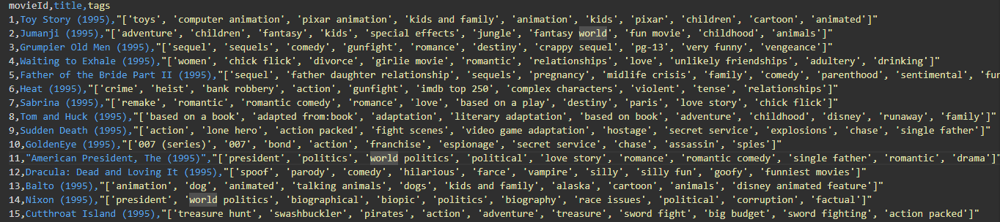

CSC173 Deep Computer Vision Project Progress Report
**Student:** Rey Iann V. Tigley, 2022-0224  
**Date:** December 18,2025
**Repository:** [CSC172-AssociationMining-Tigley](https://github.com/noneiann/CSC172-AssociationMining-Tigley)

## 📊 Current Status

| Milestone                       | Status       | Notes                                               |
| ------------------------------- | ------------ | --------------------------------------------------- |
| Dataset Understanding           | ✅ Completed | Reviewed movie–tag structure and tag distribution   |
| Data Cleaning & Filtering       | ✅ Completed | Completed Filtering and Cleaning                    |
| Transaction Construction        | ✅ Completed | Converting movie–tag pairs into transaction baskets |
| One-Hot Encoding                | ✅ Completed | Required for Apriori / FP-Growth                    |
| Frequent Itemset Mining         | ✅ Completed | Used Apriori                                        |
| Rule Generation                 | ✅ Completed | Complete                                            |
| Baseline Evaluation             | ✅ Completed | Inspected rule count, support, confidence, and lift |
| Parameter Tuning                | ✅ Completed | Adjusted min_support and min_confidence             |
| Rule Pruning & Interpretation   | ✅ Completed | Removed redundant and trivial rules                 |
| Visualization & Analysis        | ✅ Completed | Network graph / top-k rule visualization            |
| Documentation & Results Summary | ✅ Completed | Writing insights and conclusions                    |

## 1. Dataset Progress

- **Total transactions:** 13,814 movies
- **Unique tags after cleaning:** 328
- **Tag frequency threshold:** greater than 500 movies per tag
- **Relevance score range:** 0.4 to 1.0

For dataset formatting, I merged the tag and movie IDs to their respective names and performed a formatting script to format the data into transaction-based dataset ready for Apriori/FP-Growth.

**Sample Transactional Data Preview:**

### Data Cleaning Methodology

1. **Synonym Consolidation (214 mappings)**

   - Consolidated stuff:
     - Merged redundant variants
     - Consolidated plurals
     - Location adjectives
     - Film styles
     - Locations
   - I used NLP models to discover 438 similar tag pairs across two analysis rounds

2. **Stop-Tag Filtering (112 quality judgments removed)**

   - Subjective opinions: `good movie`, `bad movie`, `masterpiece`
   - Quality descriptors: `funny as hell`, `predictable`, `book was better`
   - Generic terms: `movie`, `film`, `cinema`
   - Aesthetic judgments: `beautiful`, `stunning`, `amazing cinematography`, `visually stunning`
   - Production details: `big budget`, `low budget`, `pg`, `pg-13`
   - Runtime judgments: `long`, `too long`, `too short`

3. **Frequency Pruning**
   - Kept only tags appearing in greater than 500 movies, resulting in 328 final tags
   - Ensures statistically significant patterns

## 2. Mining Progress

### Phase 1: Initial Exploration

- **Rules discovered:** 9,278
- **Issues identified:**
  - Extensive redundant tags not captured by initial cleaning lik `romance` vs `romantic`
  - Performed manual cleaning for redundant tag variants

### Phase 2: Post-Cleanup Mining

- **Rules discovered:** 438
- **Insights:**
  - Majority of transactional relationships hovered around 0.1% - 1% support
  - Dataset variability required lowering minimum support to 0.5%

### Phase 3: Transformer-Assisted Cleanup with Lowered minimum Support (Final)

- **Rules discovered:** 1,720

**Final Mining Parameters:**

- `min_support = 0.005` (0.5%)
- `min_confidence = 0.2` (20%)
- `max_itemset_length = 5`

**Rule Quality Metrics:**

- High confidence : 177 rules
- High lift : 1,593 rules
- Both high confidence AND lift: 177 rules

## 3. Challenges Encountered & Solutions

| Challenge                        | Solution                                                                                   |
| -------------------------------- | ------------------------------------------------------------------------------------------ |
| 1,128+ tags causing noisy rules  | Applied transformer similarity analysis + manual curation resulting in reduced tags to 328 |
| Redundant rules masking patterns | Implemented 214 synonym mappings + 112 stop-tags across 3 iterations                       |
| Low support for diverse patterns | Lowered `min_support` to 0.005 (0.5%)                                                      |
| Identifying semantic clusters    | Used high-lift rules to find surprising co-occurrences                                     |
| Transformer false positives      | Manually reviewed                                                                          |

## 4. Next Steps (Before Final Submission)

- [ ] Record 5-min demo video
- [ ] Write complete README.md with results
